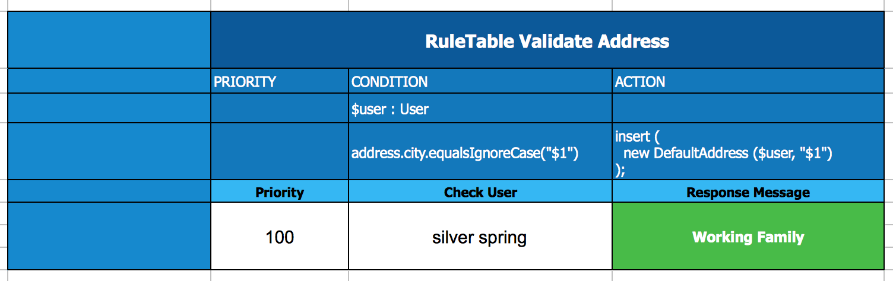

<p align='right'>
<small>Sunil Samuel<br>
web_github@sunilsamuel.com<br>
http://www.sunilsamuel.com
</small>
</p>

**<h1 align='center'>BRMS :: Testing and Debugging for Decision Tables</h1>**

# Overview

Many BRMS (Drools) application uses Excel Decision Table to author rules.  Over the years of working with the BRMS engine as a Red Hat Architect, there were several issues that I ran into which seemed as brick walls at the time.  But in most cases, these ended up being something very simple.  I wanted to capture those issues for future projects.

There are several documentations in existence that shows how to create an application to use an Excel spreadsheet as the BRMS rules, just <a href="https://www.google.com/search?q=decision+table+spreadsheet+brms" target="_blank">Google It</a>.

So, I will try to document common issues that you will run into when using spread sheet decision tables on BRMS or Drools.

## Technology Stack

* BRMS - <a href="https://developers.redhat.com/products/brms/download" target="_blank">https://developers.redhat.com/products/brms/download/</a>
* Spreadsheet (OpenOffice or Excel)
* Cucumber 

# Issues

The following are issues that I ran into.  If you would like to add to this list, please do so.

## Auto Double Quotes Replacements

Both Excel and OpenOffice Spreadsheet replaces the text-based straight double quote (") with the fancy double quote (&ldquo; and &rdquo;).  This causes the BRMS engine to throw the following exceptions

```
[8,29]: [ERR 101] Line 8:29 no viable alternative at input ''
```

You would have to disable this features.

* <a href="https://support.office.com/en-us/article/Change-curly-quotes-to-straight-quotes-and-vice-versa-017963a0-bc5f-486b-9c9d-0ec511a8fb8f" target="_blank">Excel</a>
* <a href="https://superuser.com/questions/643516/preventing-libreoffice-from-using-smart-quotes-instead-of-dumb-straight" target="_blank">OpenOffice</a>

## Null Checks

Certain rules requires we check for `null` values.  Usually null checks are validation rules and probably should not be in the business rules, but sometimes it may require it.  The condition will look as follows:


The key is to use the <b>$1</b> inside the comments that will tell the BRMS engine the parameter is being used and prevent an exception error.

## String Comparison

There are several ways to compare two strings.  The best is to use the `.equals` or `.equalsIgnoreCase` within the object may be the best.



## Spreadsheet to DRL

For the purpose of debugging, it may be easier to debug the DRL file that the decision table spreadsheet created.  You can convert the Excel spreadsheet to DRL.  To do this, update your `kmodule.xml` file to contain the following configuration parameter:

```xml
<property key="drools.dump.dir" value="/tmp/brms/classes" />
```

While you run your test cases, BRMS will create a corresponding DRL file.

```javascript
NOTE: The directory must exist, BRMS will not create the directory.
```

A sample `kmodule.xml` file is provided below:

```xml
<?xml version="1.0" encoding="UTF-8"?>
<kmodule xmlns="http://jboss.org/kie/6.0.0/kmodule" xmlns:xsi="http://www.w3.org/2001/XMLSchema-instance">
	<configuration>
		<property key="drools.propertySpecific" value="ALWAYS" />
		<property key="drools.dump.dir" value="/tmp/brms/classes" />
	</configuration>
	<kbase name="defaultKieBase" default="true" packages="*">
		<ksession name="defaultStatelessKieSession" type="stateless" default="true" />
	</kbase>
</kmodule>
```